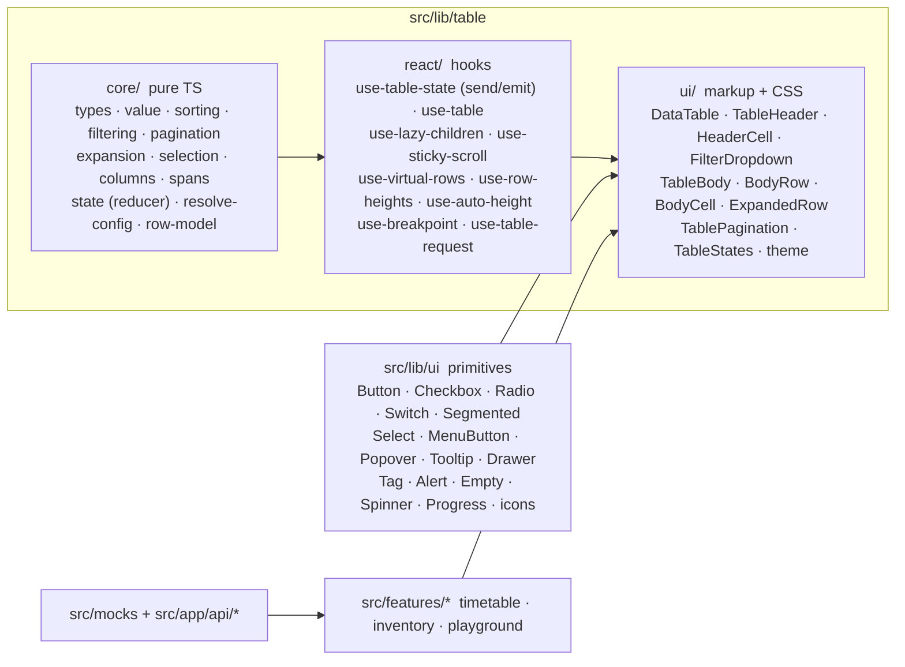

# ARCHITECTURE — how the table works

## Layers



| From | May import | Enforced by |
| --- | --- | --- |
| `core` | only other `core` files; `import type` from React is allowed for `ReactNode` in public types | `eslint.config.mjs` (`@typescript-eslint/no-restricted-imports`, `allowTypeImports`) |
| `react` | `core`, `react` | same |
| `ui` | `core`, `react`, `@/lib/ui` | same |
| `@/lib/ui` (primitives) | React only | same — no component library may be imported anywhere |
| `src/lib/table` | never `@/features`, `@/app`, `@/mocks` | same |
| `src/lib/table/core.ts` | server-safe entry (no hooks) used by route handlers | — |

## Progressive disclosure

`resolveConfig(props)` (memoised on prop identities) maps every feature to
`{ enabled: false }` or `{ enabled: true, …defaults }`. Each hook early-returns on
`enabled: false` (no state, no effect, no listener) and the renderer emits no selection / expand
column, pager or overlay unless enabled. This is both the ergonomic story ("add an
attribute, get a feature") and the performance story ("no attribute, no cost").

## Row-model pipeline (`core/row-model.ts`)

| Stage | Operation | Memo dependencies |
| --- | --- | --- |
| S1 keyed | `resolveRowKey` over the tree; `recordByKey`; duplicate/missing keys warn once | `dataSource`, `rowKey`, `childrenColumnName` |
| S2 filtered | `filterTree` via `column.onFilter` — identity when no filters | S1, `filters`, `onFilterByKey` |
| S3 sorted | stable sort per tree level; antd multi-sort merge rule; server columns (no comparator) are identity | S2, `sort`, `comparatorsByKey` |
| S4 paged | top-level only; server iff `sorted.length < total`; client `clampPage` + slice | S3, `page`, `pageSize`, `total` |
| S5 flattened | `flattenExpanded` → `FlatEntry[]` (`row` entries with depth / parent, `expanded` sentinels); lazy children merged in | S4, `expandedKeys`, mode, lazy version |
| S6 spans | `onCell` colSpan / rowSpan → `SpanMap` or `null` | S5, `onCellByKey` |

Each stage is wrapped in `memoLast`, so a page change never re-invokes the comparator and the
`currentDataSource` passed to `onChange` is the same array the next render uses. `virtual`
windows the **final** flat list; S6 runs on the whole page so spans are stable while scrolling.
Selection entities for `checkStrictly: false` are built from S3 (cross-page linkage).

## State model

```ts
interface TableState {
  sort: SortEntry[];            // >1 entry only when every entry has `multiple`
  filters: Record<string, Key[] | null>;
  page: { number: number; pageSize: number };
  selectedKeys: Key[];
  expandedKeys: Key[];
}
```

- **Controlled by key presence** (antd parity): `column.sortOrder`, `column.filteredValue`,
  `pagination.current`, `pagination.pageSize`, `rowSelection.selectedRowKeys`,
  `expandable.expandedRowKeys`. `effective = mergeControlled(internal, props, flags)`.
- **Actions:** `sort/toggle`, `filter/set`, `page/set`, `page/setSize`, `select/toggle | radio |
  page | all | invert | none | custom`, `expand/toggle | set`.
- **`reduce(prev, action, ctx)`** is pure; cross-slice rules (sort / filter / size → page 1) live
  only here. Filters and sorts never clear selection; stale keys are pruned at derive time.
- **`send`** (stable, reads a `latest` ref written in `useLayoutEffect`):
  `next = reduce(effective, action, ctx)` → `commit` writes uncontrolled slices →
  `emit(effective, next, action, props)` calls the consumer synchronously in the handler.
  `emit` is the only place any callback fires.

`emit` mapping: sort / filter → `pagination.onChange(1, size)` then `onChange(…, 'sort' | 'filter')`;
page → `pagination.onChange` (+ `onShowSizeChange`) then `onChange(…, 'paginate')`; selection →
`rowSelection.onSelect` / `onSelectAll` then `onChange(keys, rows, { type })`; expansion →
`onExpand` then `onExpandedRowsChange`. After sort / filter / paginate,
`scroll.scrollToFirstRowOnChange` scrolls the body to the top.

## Sticky columns

`table-layout: fixed; border-collapse: separate` + `<colgroup>`. Leaves are stable-partitioned
`[left…, middle…, right…]`; `left[i] = Σ width(left[<i])`, `right[j] = Σ width(right[>j])`, written
as `--dt-left` / `--dt-right` on each cell. Edge cells carry `data-fixed-edge`.
`useStickyScroll` (passive scroll + ResizeObserver, rAF-coalesced) writes `data-ping-left/right`
on the scroller only on change; CSS draws the shadow with a pseudo-element strip. No React state.

## Expansion

`useLazyChildren` keeps `Map<Key, { status, data, error, controller, generation }>` in state plus
a `version` counter that feeds S5. Expand without `loadChildren` → `ready`; cached → `ready`;
else `loading` with an `AbortController`; collapse aborts; a late response with an old
generation is dropped; `retry()` re-runs. `ExpandedRow` renders the region and the default
skeleton / alert + Retry.

## Virtual windowing

`useVirtualRows` subscribes to the scroller through `useSyncExternalStore` (scroll + resize,
rAF-coalesced) and returns a **cached** `{ start, end, top, bottom }` unless the visible index
range changes — a scroll inside the window renders nothing; a change re-renders only `<tbody>`
(the hook lives in `TableBody`). Fixed-height fast path (`rowHeight`), prefix sums + binary
search once any expanded row has been measured (`useRowHeights`, one ResizeObserver). Spacer rows
carry the off-screen height; `aria-rowcount` / `aria-rowindex` keep the semantics. `rowSpan` is
degraded to 1 under `virtual`.

## Auto height and responsive columns

`useAutoHeight` observes the wrapper's parent and the wrapper itself and sets `--dt-scroll-y`
to `parent height − table chrome` (title, pagination bars, footer). `useBreakpoint` uses
`matchMedia` for `column.responsive`.

## The primitive layer (`src/lib/ui`)

Everything the app and the table render — buttons, checkbox, radio, switch, segmented control,
select, menu, popover, tooltip, number and colour inputs, tag, alert, empty, spinner, progress,
card, collapse, drawer, toast and the icon set — is written here, on React alone. Two decisions
carry the layer:

- **One floating layer.** `Popover` renders through a portal (the table body is an
  `overflow: auto` scroller, which would clip an in-place panel), positions itself from the
  trigger's viewport rect, flips above when there is no room below, tracks scroll and resize
  through rAF, and closes on outside pointerdown or Escape. `Select`, `MenuButton` and the
  column `FilterDropdown` are all built on it.
- **Tokens, not a style engine.** `ui.css` defines `--ui-*` custom properties for light and dark;
  `data-theme` on `<html>` switches them, and a tiny inline script in the root layout applies the
  stored mode before first paint. Because no styles are computed in JavaScript, the server and
  the browser always emit identical markup.

Portals guard on `useIsClient()` (a `useSyncExternalStore` that is `false` during SSR and the
hydration pass) rather than a mount effect, which keeps the React Compiler's
`set-state-in-effect` rule satisfied.

## Server adapter

`useTableRequest(fetcher, options)` reduces `{ params, data, total, status, error }`, refetches on
`params` / `refetch()` / `deps`, aborts superseded requests, and returns exactly
`{ dataSource, loading, error, onRetry, pagination, onChange }`. Client mode uses the same hook
with a fetch-all fetcher so skeleton / error states are real in both modes.

## Failure boundaries

Failures land in one of two places, and the split is deliberate:

- **Data failures** belong to the table. A rejected fetch is state (`error` + `onRetry`,
  `locale.errorText`), and on-demand children own a second, per-row copy of that state machine.
- **Render failures** cannot be state — the component that would show them is the one that threw.
  `src/app/error.tsx` is the route boundary (shell stays mounted, `reset()` re-renders the
  segment); `src/app/global-error.tsx` catches a crash in the root layout and renders its own
  `<html>`. Neither depends on the providers above it.

## Testing layout

- `vitest.config.ts`: two projects — `core` (node) and `dom` (jsdom for `react/`, `ui/`,
  `features/`, `app/`); `--typecheck` runs `*.test-d.ts`.
- `playwright.config.ts`: e2e against a fresh production build on port 3110 — `desktop`, plus
  `tablet` (Galaxy Tab S4, 712) and `mobile` (Pixel 7, 412) running `responsive.spec.ts`. `playwright.perf.config.ts`: sequential, port 3111.
